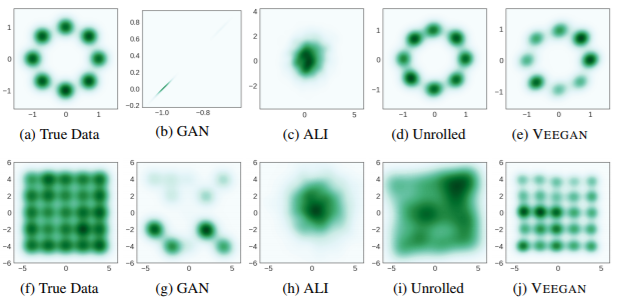
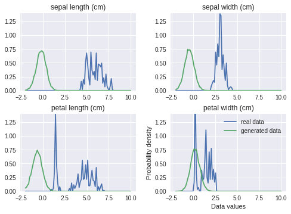
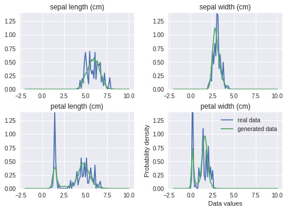

# Generative Adversarial Networks

해당 코드는 GAN 을 이용해 IRIS data 를 생성하는 코드입니다.  
GAN을 이용해 IRIS 데이터를 생성해본 결과 `petal`변수를 잘 생성해내지 못합니다.
* mode collapse 문제  

이러한 문제를 해결하기 위해 VEEGAN을 사용했습니다.
* Mixtures of Gaussians 분포 생성을 잘함




* [paper -> Generative Adversarial Networks](https://arxiv.org/abs/1406.2661)
* [paper -> VEEGAN: Reducing Mode Collapse in GANs using Implicit Variational Learning](https://arxiv.org/abs/1705.07761)

---

## Installing dependencies

Python `3.x` (tested on `3.6.1`) 에서 작성되었습니다.
```
$ pip install -r requirements.txt
```
만약 animation 기능을 이용하고 싶다면, `ffmpeg`가 필요합니다.

---

## Training

구현된 GAN

| Generative Adversarial Networks | 성능(주관적) | 하이퍼 파라미터 튜닝 난이도|
|:--:|:--:|:--:|
| GAN       | ★         | ★ |
| LSGAN     | ★★★      | ★ |
| VEEGAN    | ★★★★★   | ★★ |
| InfoGAN (튜닝 실패)   | ★★★      | ★★★★ |
| ACGAN (튜닝 실패)    | ★★★★★   | ★★★★★ |

전체 파라미터,
```
$ python VEEGAN.py --help
```
기본 실행조건으로 돌리고 싶다면,
* 마지막에 생성된 IRIS data 의 밀도함수가 그려집니다.  

```
$ python VEEGAN.py --num-steps=5000
```  

생성된 데이터와 그림을 저장하고 싶다면,
* ./iris_gan.png
* ./iris_gan.csv
두 파일이 생성됩니다.  

```
$ python VEEGAN.py --save-path=./iris_gan
```  

동영상 녹화를 하고싶다면,
* ./iris_gan.mp4
파일이 생성됩니다.  

```
$ python VEEGAN.py --anim-every=10 --anim-path=./iris_gan.mp4
```  

---

## GAN vs. LSGAN vs. VEEGAN

Density plot of generated iris data

### 1. GAN


<!-- [](http://www.youtube.com/watch?v=cJiirN6WjsE) -->

### 2. LSGAN


### 3. VEEGAN


<!-- [](http://www.youtube.com/watch?v=aEPjXqi0GxE) -->

---

### VEGAN   

학습 전 - norm 에서 난수생성    |   학습 후 - iteration : 5000
:--------:|:---------:
 | 


---  

## Author
[Juhyeong Park](https://park-ju-hyeong.github.io/)